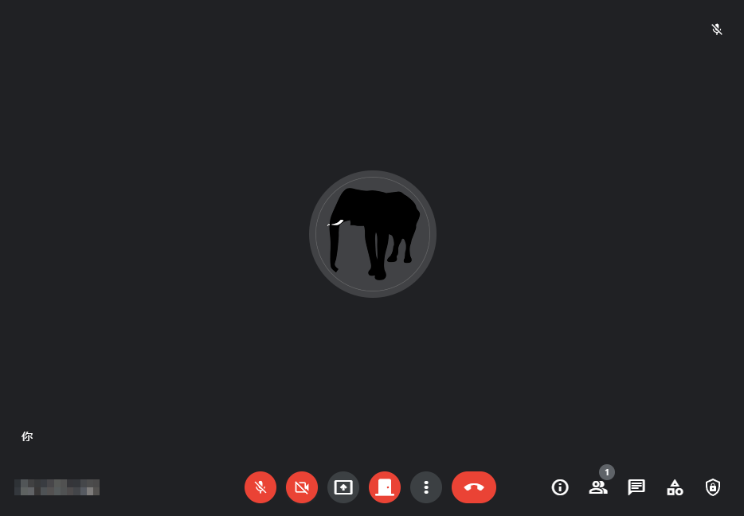

# [歡迎蒞臨](http://github.com/veringsek/google-meet-welcome)

> [English](README.md) 中文

歡迎蒞臨是一個微軟 Edge 瀏覽器的擴充功能，能自動允許使用者加入 Google Meet 會議。

## 安裝

本擴充功能可以在 [Microsoft Edge 外掛程式]() 頁面取得。

本用戶腳本可以在 [Greasy Fork](https://greasyfork.org/zh-TW/scripts/444848-google-meet-welcome) 頁面取得。

## 用法

進入會議室後，在下方會出現一個門的按鈕，這個按鈕可以用來啟用或停用歡迎蒞臨。一開始歡迎蒞臨會預設為停用，這時圖示會是一個關著的門。當歡迎蒞臨被啟用時，圖示會變為一個開啟的門。

## 授權

[MIT](http://opensource.org/licenses/MIT)

版權所有 © 中華民國111年，veringsek