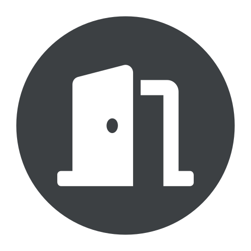
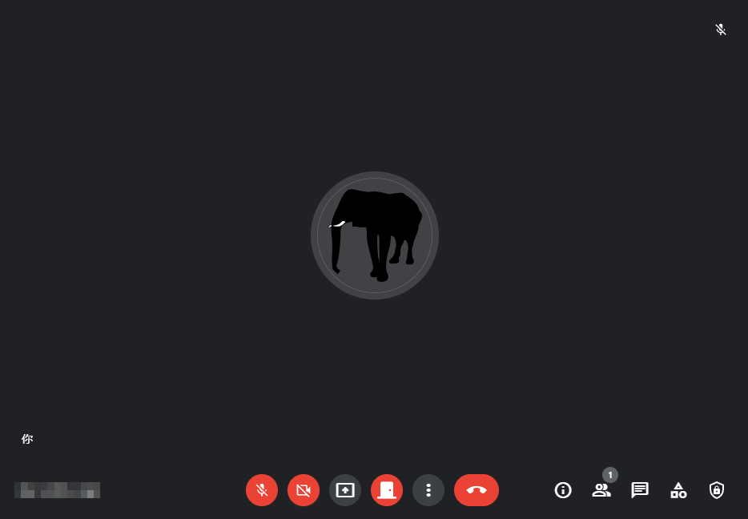
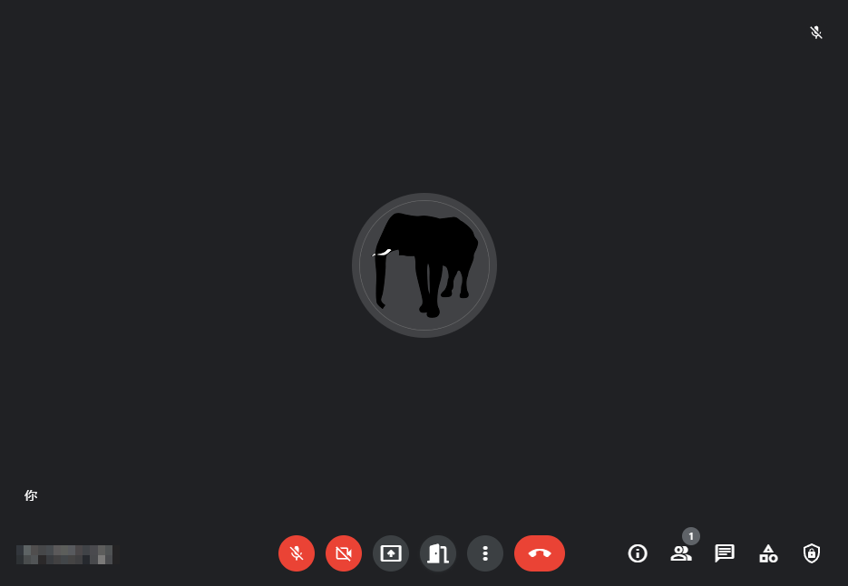

# [Welcome](http://github.com/veringsek/google-meet-welcome)

> English [中文](README-zh.md)

Welcome is a Microsoft Edge Extension to automatically accept requests to join your Google Meet meeting.

## Install

Get this extension on [Microsoft Edge Addons](https://microsoftedge.microsoft.com/addons/detail/welcome/iajbflghnchhehjfjopjlnbiaohbmkhp).

Get this userscript on [Greasy Fork](https://greasyfork.org/en/scripts/444848-google-meet-welcome).

## Usage

In the meeting room, there will be a door icon at bottom to toggle Welcome on and off. The feature is off by default, and the icon will be a closed door. Whenever the feature is on, the icon will become an open door.

## License

[MIT](http://opensource.org/licenses/MIT)

Copyright © 2022, veringsek